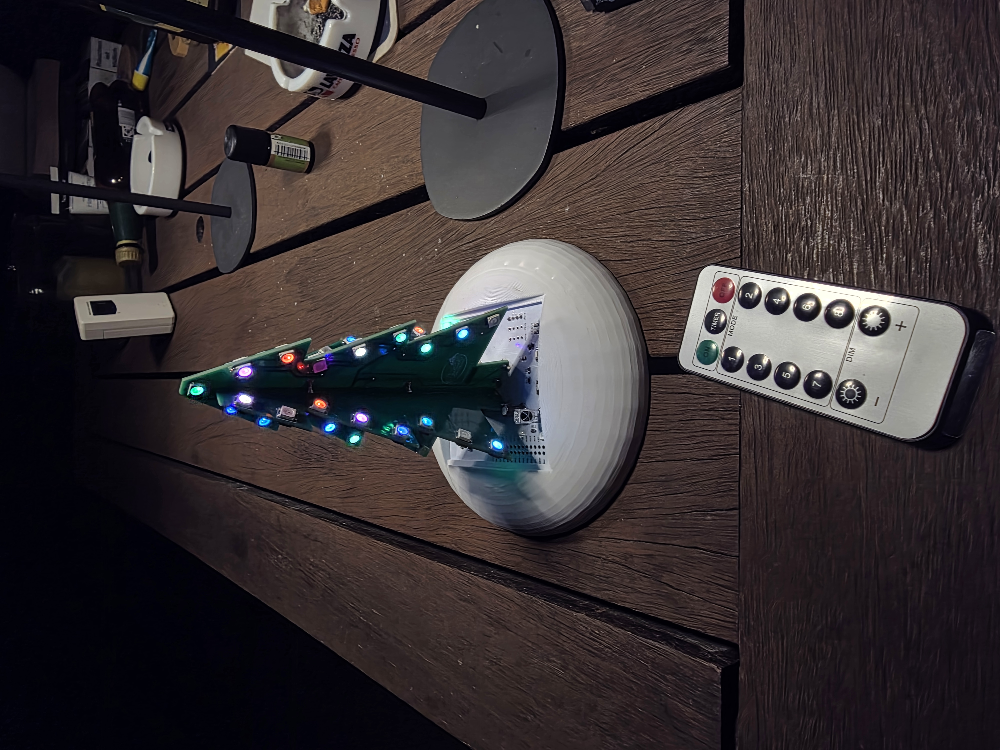

# NeoChristmasTree V2

An ESP32-powered Christmas tree ornament built from two interlocking,
fir-tree-shaped PCBs, lit by 66 individually addressable WS2812 LEDs and
controlled by an IR remote or a browser-based pattern editor.

## Highlights

- **66x WS2812 LEDs** across 4 wings (2 PCBs plugged together at a right
  angle, front and back of each), plus 2 tip LEDs at the very top.
- **IR remote control** — direct pattern selection, brightness, on/off, and
  a learnable sleep timer (30 minutes to 4 hours, set by repeatedly pressing
  the Timer button; the tree shows the corresponding "level" of its wings as
  live feedback).
- **Remote-learning mode** — any compatible IR remote's 13 buttons can be
  taught to the tree, with LED feedback on the tree itself during learning.
- **Browser-based pattern editor** — while powered via USB, the tree opens
  a local WiFi access point with a web UI (served from LittleFS) to create,
  edit, preview, and transfer lighting patterns between two trees.
- **Automatic brightness** — an onboard light sensor (LDR) adjusts LED
  brightness to the ambient light, capped by the brightness set via remote.
- **Proper power management** — on battery, switching off fully cuts power
  via a FET-driven double-click of the physical power button; on USB, the
  regulator stays active and only the LEDs go dark.

## Hardware

- ESP32 (NeoPixel data on pin 16)
- VS1838B IR receiver
- LDR for ambient-light sensing
- FET power switch to emulate a double-click power-off on battery
- Two interlocking fir-tree-shaped PCBs ("Tannenfluegellaengs" and
  "Tannenfluegelquer"), each carrying 32 of the 66 LEDs
- Main control board ("TannenbasisV4") carrying the ESP32, IR receiver, LDR
  and power management; KiCad sources for all three boards under
  `docs/Leiterplatten/`
- 3D-printed base housing; STL files under `docs/Gehäuse/`

## Repository layout

- `*.ino` / `*.h` — firmware (Arduino/ESP32 sketch)
- `data/www/` — the pattern editor web UI, uploaded to the ESP32's LittleFS
  filesystem (Arduino IDE "ESP32 Sketch Data Upload" or equivalent)
- `docs/manual/` — user manual (PDF)
- `docs/system/` — system documentation (PDF; describes an earlier hardware
  revision, kept for reference)
- `docs/Leiterplatten/` — KiCad sources, gerbers, schematic and front/back
  PCB renders for the control board and the two wing PCBs
- `docs/Gehäuse/` — STL files for the 3D-printed base housing
- `docs/Bilder/` — photos and a short clip of the finished tree

## Building

Open `NeoChristmasTreeV2.ino` in the Arduino IDE (or arduino-cli) with the
ESP32 core installed, plus the libraries IRremote, Adafruit NeoPixel,
ArduinoJson, and ESPAsyncWebServer. Flash the sketch, then upload the
contents of `data/` to the ESP32's LittleFS filesystem (e.g. via the "ESP32
Sketch Data Upload" tool) to make the pattern editor available.

Hold the mode/learn switch while powering on to enter IR remote-learning
mode.

## License

Released under the [MIT License](LICENSE).
